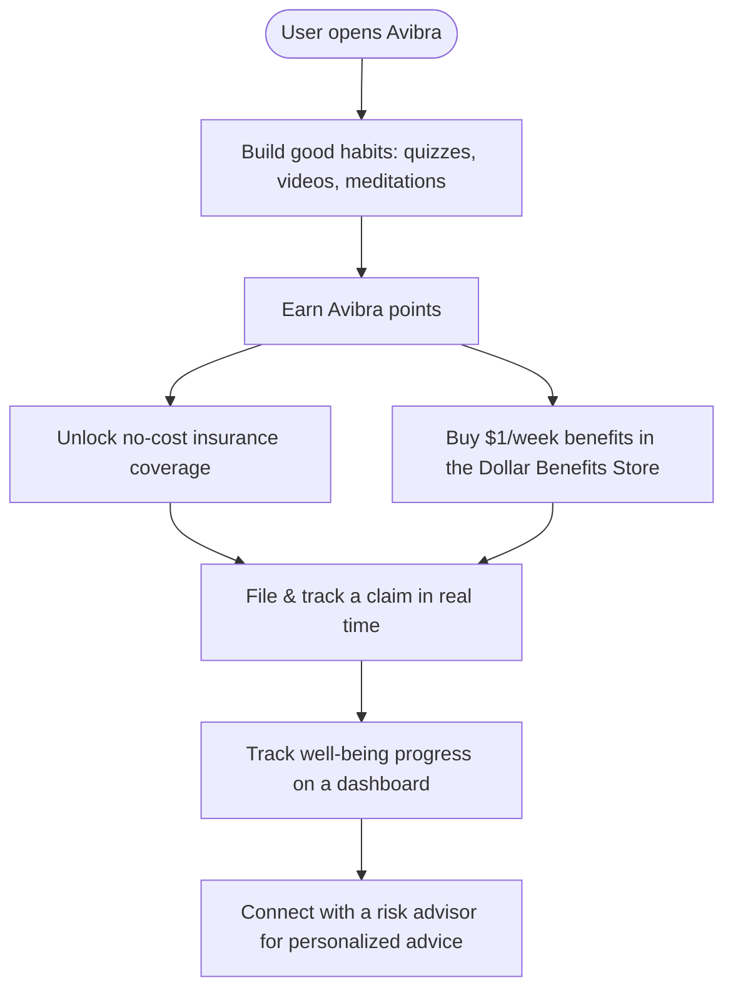
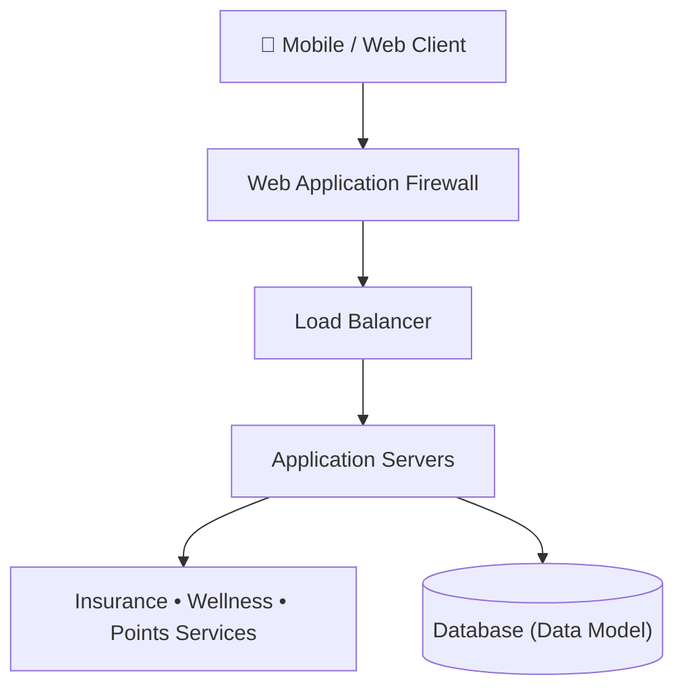

# 🛡️ Avibra — Habits‑to‑Insurance App (UI/UX + System Design)

**Avibra** is a mission‑driven app concept that turns **good habits into insurance & wellness
benefits**. This repository is the **software‑design project** for Avibra: it captures the problem,
user stories, system architecture, data model, and a full **UI/UX prototype** — documented in
[`Avibra.pdf`](Avibra.pdf) and designed in Figma.

🎨 **Figma prototype:**
[Open the interactive design](https://www.figma.com/proto/KLBZIAO7IbWiSXmwKivfbt/Avibra?node-id=141-59&starting-point-node-id=141%3A59)

---

## 🧩 Problem

- Millions of Americans — especially **part‑time and gig workers** — lack easy, affordable access to
  insurance.
- Confusing policies and low awareness leave many workers uninsured.

## 💡 Solution

Avibra provides **affordable, accessible financial, insurance, and wellness benefits** by rewarding
healthy habits. Users learn through **wellness tips, quizzes, videos, and meditations**, earn
points, and turn those good practices into **insurance coverage**.

---

## 🔄 User Journey



---

## 🧩 Key Features (User Stories)

- 📝 **File a claim** and get an instant reference number + real‑time status tracking
- 🔁 **One‑click renewal** of no‑cost membership insurance (and plant a tree via the TIST program)
- 👨‍👩‍👧 **Family benefits** — dental, vision, teletherapy & telemedicine for kids
- 🛒 **Dollar Benefits Store** — accidental, life, telemedicine, cell‑phone protection for ~$1/week
- 📊 **Progress dashboard** — track coverage earned and well‑being over time
- 🧑‍💼 **Risk advisor** — schedule a free consultation for personalized guidance

---

## 🏛️ Architecture Design



---

## 📐 Design Artifacts (in `Avibra.pdf`)

The report walks through a complete software‑design lifecycle:

| Artifact | Purpose |
|----------|---------|
| **Data Flow Diagram (DFD)** | How data moves through the system |
| **Use‑Case Diagram** | Actors and their interactions |
| **State Diagram** | Lifecycle of a claim / user session |
| **Architecture Design** | WAF → Load Balancer → App → DB tiers |
| **Data Model** | Core entities and relationships |
| **Agile Plan** | Iterative development approach |
| **UI/UX Design** | Screens & the Figma prototype |

---

## 🗂️ Repository Contents

```
Avibra/
├── Avibra.pdf   # Full design document (problem, user stories, diagrams, UI/UX)
└── README.md
```

---

## 👥 Team

Khushi Shukla · Akshit Khokhani · Tanish Bansal · **Mann Patel** · Aumkar Joshi · Niraj Raj

> A collaborative **UI/UX design & system‑design** project exploring how positive habits can be
> translated into accessible insurance and wellness benefits.
